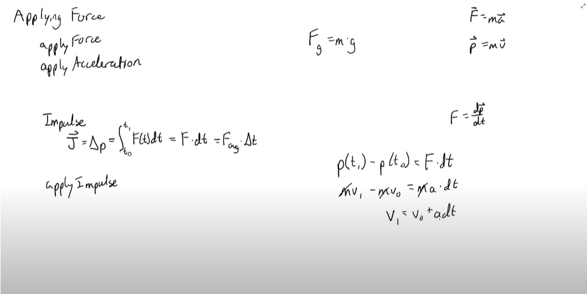
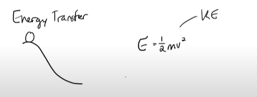

# Learn_OpenGL

Game Physics Related:

Impulse:

这里通过动量公式可知，使用p0时的动量减去p1时的动量得到最后的冲量大小

Energy Transfer:
动能(Kenetic Energy):
Ek = 1/2 * m * v^2 

Tutorial Website:
https://www.youtube.com/watch?v=Z4I_EEskNK4&list=PLysLvOneEETPlOI_PI4mJnocqIpr2cSHS&index=7

Other Helpful Reference:

[一步步学OpenGL3.3+](https://www.zhihu.com/column/c_1375900139991678976)

[NCLGL-based-on-OpenGL-Game-Engine](https://github.com/kfj24/NCLGL-based-on-OpenGL-Game-Engine)